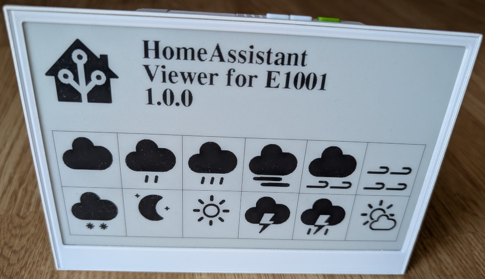
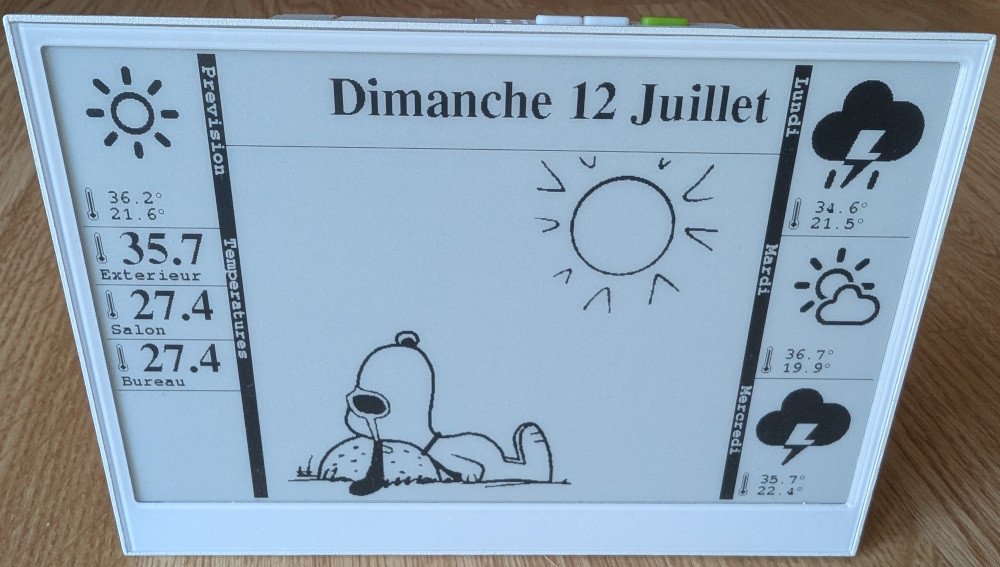

# reTerminal E1001 Home Assistant Viewer
Display Home Assistant weather information on reTerminal E1001

## Installation and configuration

- Clone the project
```
git clone git@github.com:colas-sebastien/reTerminal-E1001-homeassistant-viewer.git
```
- [Install and configure Arduino IDE](https://wiki.seeedstudio.com/reterminal_e10xx_with_arduino/) (official guide by Seeed)
- Update the configuration file: `config.h`
- Upload on you device

## Default behaviour
1. At startup the welcome screen is displayed
2. Device try to connect wifi (blinking green led)
3. Device get Home Assistant information (green led off)
4. Device waits 20s before deep sleeping for 5min and go to step 2

If device is not able to get connect wifi device will deep sleep for 8 hours.

Device can be wake up from deep sleep by pressing green button.


## How to add custom images dependinf of the current weather

You can illustrate the current weather with your own images.
Here are the files you need to create on the SDCard you will insert to the device:

```
├── 512_400
│   ├── battery.bmp
│   ├── clear-night.bmp
│   ├── cloudy.bmp
│   ├── exceptional.bmp
│   ├── fog.bmp
│   ├── hail.bmp
│   ├── lightning.bmp
│   ├── lightning-rainy.bmp
│   ├── partlycloudy.bmp
│   ├── pouring.bmp
│   ├── rainy.bmp
│   ├── snowy.bmp
│   ├── sunny.bmp
│   ├── windy.bmp
│   └── windy-variant.bmp
├── 800_480
│   └── sleep.bmp
```
The files must be BMP 2bit color, here is how to create one thanks to Gimp:
- Open your source image
- resize if needed (800x480 or 512x400)
- Execute the command: Image / Mode / Indexed
  - select Generate optimum palette
  - Maximum  number of colors: 2
- double click on colors and adjuste black & white
- Execute the command: Colors / Map / Rearange Colors
  - Color 0: White
  - Color 1: Black
  - reorder if needed
- Execute the command: File / Export as...
  - give a name with .bmp as extension
  - Don't check the box: Write color space informaiton
  - Confirm that RGB format is 24 bit (R8 G8 B8)



## TODO
- When device is refresh if right.left button is pressed display another screen like temperature graph...
- Detect weather alerts and display